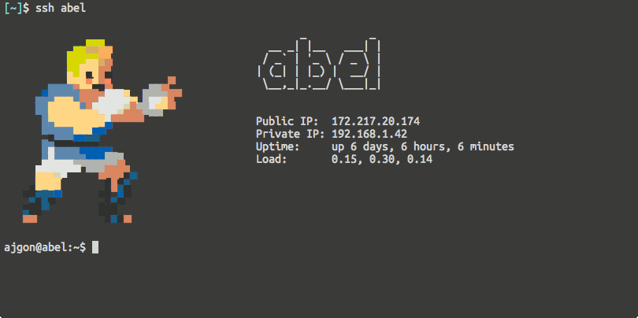

# Street Fighter MOTD

## Why?

[Because I can](https://youtu.be/Y6ljFaKRTrI?t=23). Also, I was inspired by
[this article](https://tylercipriani.com/blog/2014/05/22/creating-baller-useful-motd-ascii-art/).

## How?

### Requirements

* [VirtualBox](https://www.virtualbox.org/)
* [Vagrant](https://www.vagrantup.com/)

### Configuring

* Edit [host-data.txt](host-data.txt) file, it will be appended to final MOTDs.
  If you wish to use variables, put their names between `##`. For example
  `##PUBLIC_IP##` will be replaced by `PUBLIC_IP` shell variable during
  `update-motd` script action.
* Edit [motd-variables](dist/vars/motd-variables) file, and set all the variables
  which you defined in previous file.

### Building

* Fire `vagrant up` and wait for the script to finish.

### Installing

* Set a desired hostname on your machine i.e. `hostnamectl set-hostname blanka`
* Copy all contents of the `dist` directory (preserving directory structure) to
  `/etc/update-motd.d/` on the desired machine.
* Install `update-motd` i.e. `apt-get install update-motd`

## Troubles?

[Open an issue](https://github.com/ajgon/street-fighter-motd/issues).

## License

[MIT License](LICENSE)
